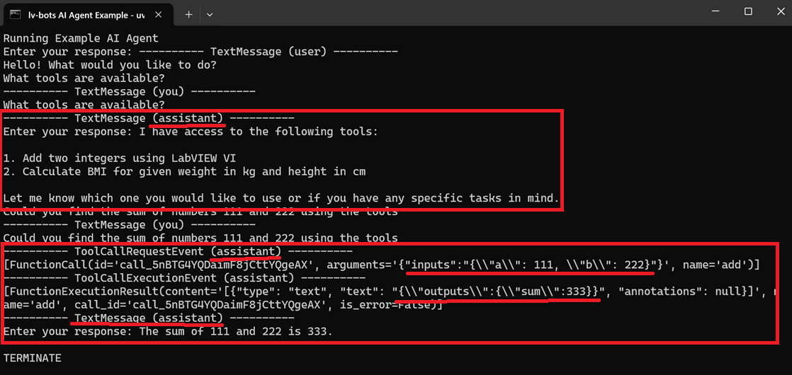
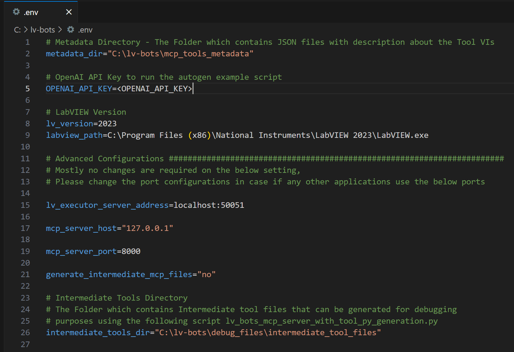
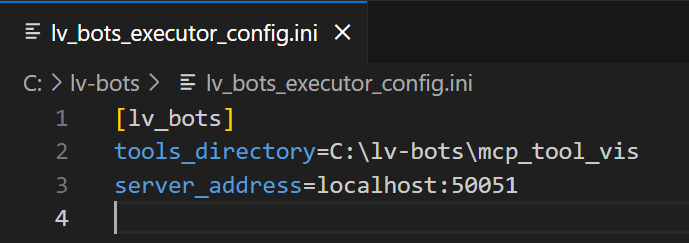
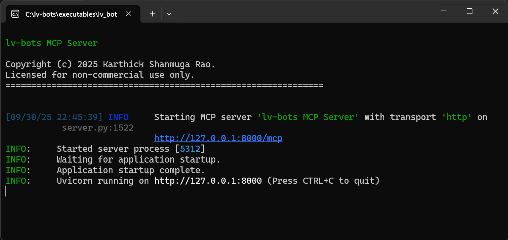

- [lv-bots-mcp-server - `Enabling AI Agents to utilize LabVIEW Tools`](#lv-bots-mcp-server---enabling-ai-agents-to-utilize-labview-tools)
- [1. Purpose and Long Term Vision](#1-purpose-and-long-term-vision)
  - [1.1. Purpose](#11-purpose)
  - [1.2. Feature Roadmap](#12-feature-roadmap)
- [2. lv-bots in Action - Quick Setup and Run](#2-lv-bots-in-action---quick-setup-and-run)
- [3. Current Features and Limitations](#3-current-features-and-limitations)
  - [3.1. Features](#31-features)
  - [3.2. Limitations of Current Version](#32-limitations-of-current-version)
- [4. User Guide (Additional Details)](#4-user-guide-additional-details)
  - [4.1. Configuration and Metadata Files](#41-configuration-and-metadata-files)
  - [4.2. Launching the lv-bots](#42-launching-the-lv-bots)
  - [4.3. AI Agent using the Example Tool VIs](#43-ai-agent-using-the-example-tool-vis)
  - [4.4. lv-bots Terminal Windows](#44-lv-bots-terminal-windows)
  - [4.5. A Note about LabVIEW Application Restart](#45-a-note-about-labview-application-restart)
  - [4.6. 📑 JSON Metadata File Format](#46--json-metadata-file-format)
    - [4.6.1. Metadata JSON](#461-metadata-json)
    - [4.6.2. Example](#462-example)


# lv-bots-mcp-server - `Enabling AI Agents to utilize LabVIEW Tools`
lv-bots-mcp-server is a Python-based **Model Context Protocol (MCP)** server that dynamically registers LabVIEW VIs as tools for AI agents / applications.  


# 1. Purpose and Long Term Vision
## 1.1. Purpose
1. The purpose of this project is to make **LabVIEW VIs / Code modules seamlessly usable by AI agents**.
2. **Bridge the gap between modern AI-driven multi-agent ecosystem and existing or new LabVIEW resources available** like automation tools, labview scripting tools, algorithms, testing frameworks, calculation VIs, etc.,
3. **Enables AI agents to reuse existing code - Developers should not spend efforts to rewrite or migrate the LabVIEW resources in order to integrate with AI agents**

## 1.2. Feature Roadmap
1. ✅ **AI-driven LabVIEW integration** – Any existing LabVIEW VI should be callable by AI agents through MCP (Model Context Protocol) open standard.  
2. ✅ **Metadata-driven understanding** – AI agents leverage JSON metadata files to understand a VI’s purpose, inputs, and outputs.  
3. ✅ **MCP-first approach** – Since most platforms (like **n8n**, **AutoGen**, etc.) already support MCP integration, this project follows the **MCP standard** for maximum interoperability.  
4. ✅ **Auto Generate the metadata JSON that describes the Tool VIs avaialble** – Today, metadata JSONs are created manually. In the future, metadata will be **auto-generated** from VI descriptions, connector pane details, and control/indicator properties.  
5. ✅ **Tool chaining** – In Future Enable advanced workflows where **outputs from one VI can serve as inputs for another**, allowing AI agents to intelligently chain LabVIEW tools to perform complex tasks.  
 

# 2. lv-bots in Action - Quick Setup and Run
1. Download the Setup Zip file from the Releases. Unzip and Run the Installer.
   1. [Alpha v0.3 Setup - Download Link](https://github.com/karthickshanmugarao/lv-bots-public-releases/releases/download/lv-bots-alpha-v0.3/LV-Bots-Setup-v0.3.3.zip)
2. lv-bots will be installed at `C:\lv-bots`
3. Add your `OPENAI_API_KEY` in the `C:\lv-bots\.env`
4. Open and run the `C:\lv-bots\lv_bots_launcher.vi` in LabVIEW (32-bit) to launch the MCP Server.
5. Two terminals will be opened
   1. One for lv-bots MCP Server, and 
   2. Another for the Example AI Agent. 
   3. Interact with the agent in the terminal which can run the tools based on the prompts.
6. **Example Tools** are available at `C:\lv-bots\mcp_tool_vis`
   1. `add.vi` - Adds two numbers given as input.
   2. `calculate_bmi.vi` - Calculates BMI for given weight in kg and height in cm.
   3. `scripting_create_vi.vi` - Creates a New VI at the specified file path using the Template VI path given.
7. **Metadata JSON Files** that describes the tools are at `C:\lv-bots\mcp_tools_metadata`. 
8.  **Below is the Example Chat session where AI agent lists the tools and uses right tool** based on prompt with right inputs.
    1.  Tools listed are (`add.vi` and `calculate_bmi.vi`) which are available from the repository as examples.
    2.  AI agent runs the `add.vi` tool based on the prompt to find the sum of two numbers. 
    3.  
9.   To include more tool VIs - Add the VIs and respective Metadata files in the folders `mcp_tool_vis` and `mcp_tools_metadata`.
     1.   The folder locations can be changed by modifying few keys in `.env` and `lv_bots_executor_config.ini`. Refer the `User Guide` Section.
     2.   Refer [4.6.1. Metadata JSON](#461-metadata-json) to create metadata files for new tool VIs.
10.    **Closing lv-bots** - To exit lv-bots, close all the open terminals and the lv_bots_executor_service VI front panel.
11.    Refer [User Guide](#4-user-guide-additional-details) for more details

# 3. Current Features and Limitations
## 3.1. Features
- **MCP Tool Registration** – MCP Tools registerd for each `.json` file in the metadata folder.
- **MCP Server** – The tools registered in lv-bots MCP Server can be used by any AI Agent / Platform that supports the Model Context Protocol.
- **LabVIEW VI Execution** – MCP Server executes LabVIEW VIs using a separate lv-bots Executor service.
- **Example AI Agent** - An Example AI Agent is available to interact over a terminal window. This requires OpenAI API Key in `.env`.

## 3.2. Limitations of Current Version

1. **Supported LabVIEW Version** - Supports only 32-bit LabVIEW Versions (>=2023 Q3)
3. **Supported Data Types**  
   - Currently, only VIs with the following Input Data Types are supported **String**, **Numeric**, **Boolean**, **1D Arrays**, and **Simple Clusters (not nested)** 
   - Complex data types such as enums, multi dimensional arrays, arrays of clusters are not yet handled.

4. **Manual Metadata Creation**  
   - Metadata `.json` files must be created manually for each VI.  
   - There is no automation yet to generate metadata directly from LabVIEW VIs.  
   - The JSON must follow the defined schema for the tool generator to work.

5. **Chaining of Tools is currently not supported directly**, But with prompt engineering limited chaining is possible. For Tool VIs with simple datatypes AI agents are able to understand the output data and construct the inputs to make subsequent tool calls.


# 4. User Guide (Additional Details)
## 4.1. Configuration and Metadata Files
**Note:**
**If you just want to try the examples,** `only the OPENAI_API_KEY is required, No other configuration changes needed in any of the below prerequisite files`
1. **`.env` File**  
   - To run example tools, only the `OPENAI_API_KEY` config is required.
   - Update the file with the following details.
     - `OPENAI_API_KEY` – Your OpenAI API key. This will be used by the autogen example to create a AI Agent.  
     - `metadata_dir` – Directory containing JSON metadata files that describes the Tool VIs.  
     - `lv_executor_server_address` – Server address for the LabVIEW lv_bots_executor grpc service.
     - `lv_version` - Specify the LabVIEW version to use for the executor service.
     - 
     - `intermediate_tools_dir` - `optional config` – Output Directory to store generated MCP tool `.py` files. These intermediate files will be generated only for debugging purposes when using the following script `g_mcp_server_with_tool_py_generation.py` 

2. **lv-bots Executor configuration INI**
   - `No changes needed if you are just trying examples in this repo`
   - Open the following configuration file `lv_bots_executor_config.ini`
   - Configure `tools_directory` as the Absolute path of the Folder which contains the tool VIs to be used by AI agents.
   - Configure the server address as well, this should match with the `lv_executor_server_address` in `.env` file.
   - 

3. **JSON Metadata Files**  
   - `No changes needed if you are just trying examples in this repo`
   - These are files that explain the available LabVIEW tools in `tool_vis` folder.
   - The example JSON files are stored in the `mcp_tools_metadata/` folder.  
   - One JSON file per MCP tool.
   - Format of these metadata files are explained in the **JSON Metadata Format** section.
  
4. **LabVIEW VIs**  
   - `No changes needed if you are just trying examples in this repo`
   - These are the LabVIEW VIs that AI agents will use as tools.
   - Examples are stored in the `mcp_tool_vis/` folder.  
   - The VI file name should match the JSON file name.

## 4.2. Launching the lv-bots
1. To launch the lv-bots, **Open and run the `lv_bots_launcher.vi`**  which will open terminal windows explained in the section **`lv-bots Terminal Windows`**

## 4.3. AI Agent using the Example Tool VIs
1. After the VI `lv_bots_launcher.vi` is run, the Example AI Agent terminal window will allow user to interact with AI agent that can list the tools and run them based on prompts.
2. In this example: User queries the list of tools available and uses the `add.vi` tool to perform addition.
   - 
3. **Example Tools** are at `lv-bots\mcp_tool_vis`
   1. `add.vi` - Adds two numbers given as input.
   2. `calculate_bmi.vi` - Calculates BMI for given weight in kg and height in cm.
   3. `scripting_create_vi.vi` - Creates a New VI at the specified file path using the Template VI path given.
   4. The tools folder can be changed to different location by updating the key `tools_directory` in the configuration file `lv_bots_executor_config.ini`
4. **Metadata JSON Files** that describes the tools are at `C:\lv-bots\mcp_tools_metadata`. 
   1. The metadata folder can be changed to different location by updating the `metadata_dir` key in `.env`

## 4.4. lv-bots Terminal Windows
Following are the different terminal windows that will be launched by the VI `lv_bots_launcher.vi`.

   1. `lv-bots MCP Server` - This is the MCP server with which AI agents will communicate. This will:
     - Read all JSON metadata files.
     - Create MCP tools for each LabVIEW VI and register all tools with the MCP server.
     - Start the MCP HTTP server.
     - 
   2. `lv-bots Example AI Agent` - This window will allow you to interact with AI agent that can make use of the Tool VIs.
     - Query what tools are available.
     - Ask AI agent to use the tools to perform actions.
     - 
  
## 4.5. A Note about LabVIEW Application Restart
1. In case of any error during lv-bots Launch using the `lv_bots_launcher.vi`, retry the launcher after closing all files in LabVIEW using `File --> Close All` or `File --> Quit`.

## 4.6. 📑 JSON Metadata File Format

Each LabVIEW VI tool is described by a **metadata JSON file**.  
This metadata enables AI agents (via MCP) to understand the **purpose, inputs, and outputs** of the VI.  

### 4.6.1. Metadata JSON
Following are the keys expected in Metadata JSON

- **name** → The tool/VI name (without extension).  
- **description** → A human-readable explanation of what the VI does.  
- **inputs_meta** → A dictionary where each key is an **input parameter name** and the value describes:
  - `type`: The datatype (e.g., `int`, `float`, `string`, `json`, `array`).
  - `description`: What the parameter represents.  
- **outputs_meta** → A dictionary describing each output parameter, with the same structure as `inputs_meta`.

### 4.6.2. Example

```json
{
  "name": "add",
  "description": "Add two integers using LabVIEW VI",
  "inputs_meta": {
    "a": {
      "type": "int",
      "description": "First number"
    },
    "b": {
      "type": "int",
      "description": "Second number"
    }
  },
  "outputs_meta": {
    "sum": {
      "type": "int",
      "description": "Result of the add"
    }
  }
}
```
